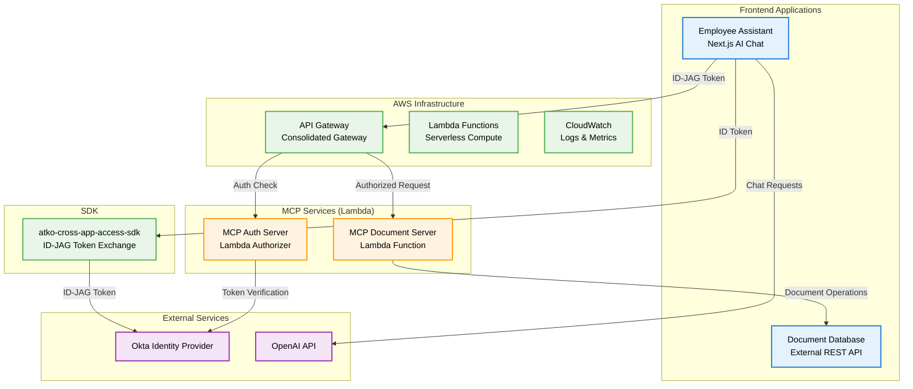
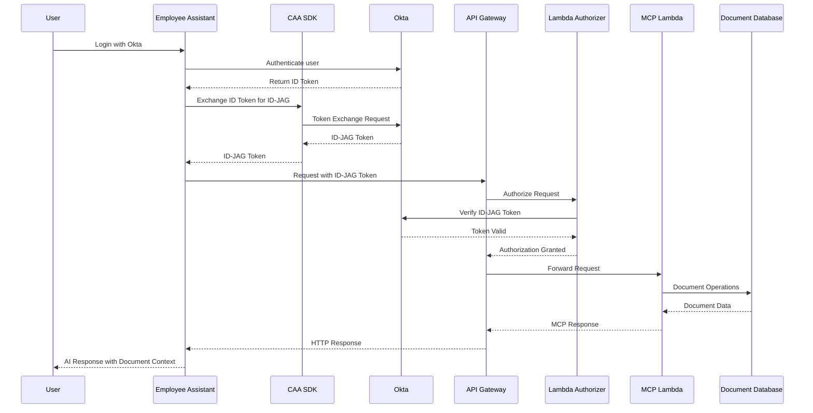
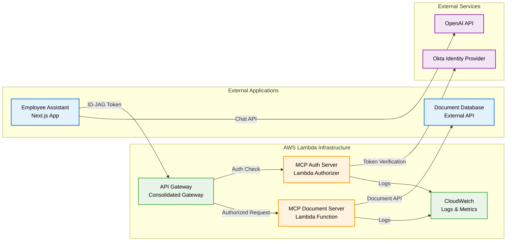

# Atko MCP - AWS Lambda Deployment Guide

A comprehensive guide for deploying the Atko MCP services to AWS Lambda using AWS SAM with cross-application access using Okta's ID-JAG tokens.

## 🏗️ AWS Lambda Architecture



## 🔐 Authentication Flow



## 📦 Service Descriptions

### 🎯 **Employee Assistant** (`employee-assistant/`)
**Purpose**: AI-powered chat interface for employee assistance with document access
- **Technology**: Next.js 15, React 19, NextAuth.js, OpenAI API
- **Features**: 
  - **Okta authentication** with **ID-JAG token exchange**
  - AI chat with document context
  - Document search and creation via MCP
  - Real-time ID-JAG token display
  - **Cross-app access** to document database
  - **Lambda deployment mode** support
- **Port**: 3000 (development)
- **Deployment**: Any platform (connects to Lambda)

### 📚 **Document Database** (`internal-document-database/`)
**Purpose**: REST API for company document management
- **Technology**: Next.js 15, TypeScript, JSON file storage
- **Features**:
  - CRUD operations for documents
  - Category-based organization
  - Search functionality
  - Tag-based filtering
- **Port**: 3001 (development)
- **Deployment**: External (Vercel or other platform)

### 🔐 **MCP Auth Server** (`atko-document-server-mcp-auth/`)
**Purpose**: Lambda authorizer for MCP access token validation
- **Technology**: AWS Lambda, TypeScript, Jose JWT
- **Features**:
  - **Okta ID-JAG token verification**
  - MCP access token generation
  - **Cross-app authorization enforcement**
  - **Secure token validation** for API Gateway
- **Runtime**: Node.js 18.x
- **Deployment**: AWS Lambda (separate from main MCP server)

### 🛠️ **MCP Document Server** (`atko-document-server-mcp/`)
**Purpose**: MCP server for document operations
- **Technology**: AWS Lambda, TypeScript, MCP SDK
- **Features**:
  - Document search via MCP tools
  - Document creation via MCP tools
  - JWT access token verification
  - HTTP transport implementation via API Gateway
- **Runtime**: Node.js 18.x
- **Deployment**: AWS Lambda with API Gateway

### ☁️ **AWS Infrastructure**
**Purpose**: Serverless infrastructure for MCP services
- **Technology**: AWS SAM, CloudFormation, API Gateway, Lambda
- **Features**:
  - **Consolidated API Gateway** with authorizer
  - **Serverless Lambda functions** for scalability
  - **CloudWatch monitoring** and logging
  - **IAM role management** for security
- **Deployment**: AWS CloudFormation via SAM

## 🚀 Deployment Architecture



## 🔧 Prerequisites

- Node.js 18+
- Git
- AWS Account
- AWS CLI installed and configured
- AWS SAM CLI installed
- Okta Developer Account
- OpenAI API Key

## 🚀 Quick Start

### **1. Install Dependencies**
```bash
# Install AWS CLI
brew install awscli

# Install AWS SAM CLI
brew install aws-sam-cli

# Configure AWS credentials
aws configure
```

### **2. Clone and Setup**
```bash
git clone <repository-url>
cd okta-cross-app-access-demo
```

### **3. Configure Environment Variables**

#### **Employee Assistant**
```bash
cd employee-assistant
cp env.local.template .env.local
```

Edit `.env.local`:
```bash
# NextAuth Configuration
NEXTAUTH_URL=http://localhost:3000
NEXTAUTH_SECRET=your-nextauth-secret-key-change-in-production

# OpenAI Configuration
OPENAI_API_KEY=your-openAI-API-key

# Okta Configuration
OKTA_CLIENT_ID=your-okta-client-id
NEXT_PUBLIC_OKTA_CLIENT_ID=your-okta-client-id
OKTA_CLIENT_SECRET=your-okta-client-secret
OKTA_ISSUER=https://your-domain.okta.com
OKTA_BASE_URL=https://your-domain.okta.com
NEXT_PUBLIC_OKTA_BASE_URL=https://your-domain.okta.com

# ID-JAG Configuration
ID_JAG_AUDIENCE=http://localhost:5001
ID_JAG_CLIENT_ID=your-id-jag-client-id
ID_JAG_CLIENT_SECRET=your-id-jag-client-secret

# MCP Deployment Configuration
MCP_DEPLOYMENT_MODE=lambda

# Lambda Deployment
MCP_LAMBDA_URL=https://your-api-gateway.amazonaws.com/prod/mcp
```

### **4. Set AWS Environment Variables**
```bash
export DOCUMENT_DATABASE_URL="https://your-document-database.vercel.app/api"
export JWT_SECRET="your-long-random-jwt-secret-here"
export OKTA_ISSUER="https://your-domain.okta.com"
export ID_JAG_AUDIENCE="https://your-domain.com"
```

### **5. Deploy Using SAM Script**
```bash
# Deploy both MCP server and auth services
./deploy-sam.sh
```

## 🧪 Testing

### **Local Testing**
```bash
# Test Lambda functions locally
cd atko-document-server-mcp
sam local start-api

cd ../atko-document-server-mcp-auth
sam local invoke McpAuthorizerFunction --event events/authorizer-event.json
```

### **Production Testing**
```bash
# Test all endpoints (all require authentication)
curl -H "Authorization: Bearer YOUR_ID_JAG_TOKEN" \
  https://your-api-gateway.amazonaws.com/prod/mcp/health

curl -H "Authorization: Bearer YOUR_ID_JAG_TOKEN" \
  https://your-api-gateway.amazonaws.com/prod/mcp/tools/call \
  -d '{"tool":"search_documents","arguments":{"query":"test"}}'
```

## 🔍 Monitoring

### **CloudWatch Logs**
```bash
# List Lambda log groups
aws logs describe-log-groups --log-group-name-prefix '/aws/lambda/atko-document-server-mcp'

# View MCP server logs
aws logs tail /aws/lambda/atko-document-server-mcp-McpServerFunction-* --follow

# View authorizer logs
aws logs tail /aws/lambda/atko-document-server-mcp-aut-McpAuthorizerFunction-* --follow
```

### **CloudWatch Metrics**
- Function invocation count
- Duration and error rates
- Throttling metrics
- Concurrent execution

### **X-Ray Tracing**
- Distributed tracing for request flows
- Performance analysis
- Error tracking

## 🔒 Security

- **ID-JAG Tokens**: Secure cross-app identity assertion
- **Lambda Authorizer**: Serverless token validation
- **IAM Roles**: Minimal required permissions
- **API Gateway**: HTTPS enforcement and CORS management
- **Environment Variables**: Secure configuration management

## 🛠️ Development

### **Adding New MCP Tools**
1. Add tool logic to `atko-document-server-mcp/src/lambda.ts`
2. Update tool definitions in the `/tools` endpoint
3. Test locally with `sam local start-api`

### **Local Development**
```bash
# Build and test locally
cd atko-document-server-mcp
npm run build:lambda
sam build
sam local start-api

# Test authorizer locally
cd ../atko-document-server-mcp-auth
npm run build:lambda
sam build
sam local invoke McpAuthorizerFunction --event events/authorizer-event.json
```

### **Manual Deployment**
```bash
# Deploy MCP Document Server
cd atko-document-server-mcp
npm run build:lambda
sam build
sam deploy --guided

# Deploy MCP Auth Server
cd ../atko-document-server-mcp-auth
npm run build:lambda
sam build
sam deploy --guided
```

## 📊 Performance & Cost

### **Lambda Settings**
- **Memory**: 512MB (adjust based on needs)
- **Timeout**: 30 seconds (adjust based on external API calls)
- **Concurrency**: Set limits if needed

### **API Gateway Settings**
- **Caching**: Enable for static responses
- **Throttling**: Set rate limits
- **Compression**: Enable for large responses

### **Cost Optimization**
```bash
# Monitor Lambda costs
aws ce get-cost-and-usage \
  --time-period Start=2024-01-01,End=2024-01-31 \
  --granularity MONTHLY \
  --metrics BlendedCost \
  --group-by Type=DIMENSION,Key=SERVICE
```

## 📚 Resources

- [Okta Cross App Access](https://help.okta.com/oie/en-us/content/topics/apps/apps-cross-app-access.htm)
- [MCP Specification](https://modelcontextprotocol.io/)
- [AWS Lambda Documentation](https://docs.aws.amazon.com/lambda/)
- [AWS SAM Documentation](https://docs.aws.amazon.com/serverless-application-model/)
- [API Gateway Documentation](https://docs.aws.amazon.com/apigateway/)
