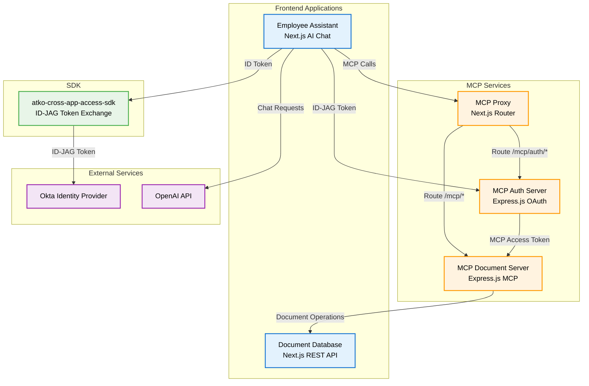
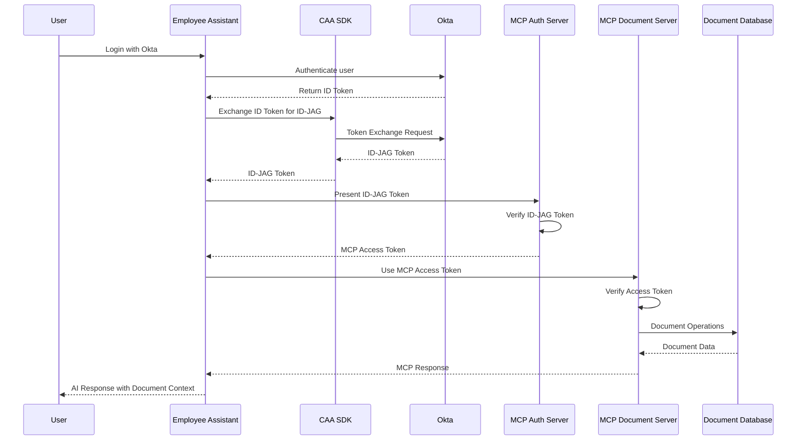
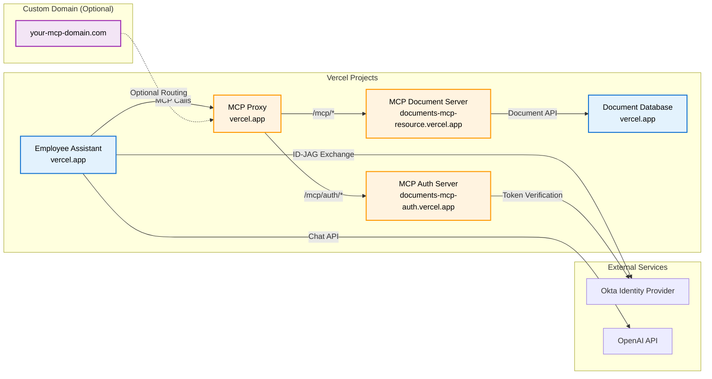

# Atko Cross-App Access (CAA) with Okta

A comprehensive implementation of Okta **[Cross-App Access (CAA)](https://www.okta.com/newsroom/press-releases/okta-introduces-cross-app-access-to-help-secure-ai-agents-in-the/)** using [OAuth 2.1 Identity Assertion Authorization Grant (ID-JAG)](https://datatracker.ietf.org/doc/draft-parecki-oauth-identity-assertion-authz-grant/) with Model Context Protocol (MCP). This project demonstrates secure cross-application authorization patterns where multiple applications can securely access each other's resources using Okta as the central identity provider.

## 🏗️ Architecture Overview

## 🔐 Authentication Flow

## 📦 Service Descriptions

### 🎯 **Employee Assistant** (`employee-assistant/`)
**Purpose**: AI-powered chat interface for employee assistance with document access
- **Technology**: Next.js 15, React 19, NextAuth.js, OpenAI API
- **Features**: 
  - **Okta authentication** with **ID-JAG token exchange**
  - AI chat with document context
  - Document search and creation via MCP
  - Real-time ID-JAG token display
  - **Cross-app access** to document database
- **Port**: 3000 (development)
- **Deployment**: Vercel

### 📚 **Document Database** (`internal-document-database/`)
**Purpose**: REST API for company document management
- **Technology**: Next.js 15, TypeScript, JSON file storage
- **Features**:
  - CRUD operations for documents
  - Category-based organization
  - Search functionality
  - Tag-based filtering
- **Port**: 3001 (development)
- **Deployment**: Vercel

### 🔐 **MCP Auth Server** (`atko-document-server-mcp-auth/`)
**Purpose**: OAuth 2.0 authorization server for MCP access
- **Technology**: Express.js, TypeScript, Jose JWT
- **Features**:
  - **Okta ID-JAG token verification**
  - MCP access token issuance
  - **Cross-app authorization enforcement**
  - **Secure token exchange** between applications
- **Port**: 3003 (development)
- **Deployment**: Vercel

### 🛠️ **MCP Document Server** (`atko-document-server-mcp/`)
**Purpose**: MCP server for document operations
- **Technology**: Express.js, TypeScript, MCP SDK
- **Features**:
  - Document search via MCP tools
  - Document creation via MCP tools
  - JWT access token verification
  - HTTP transport implementation
- **Port**: 3002 (development)
- **Deployment**: Vercel

### 🔗 **MCP Proxy** (`atko-mcp-proxy/`)
**Purpose**: Unified routing for MCP services
- **Technology**: Next.js, Vercel Rewrites
- **Features**:
  - Path-based routing to backend services
  - CORS header management
  - Environment-based backend URL configuration
- **Deployment**: Vercel

### 📦 **CAA SDK** (`atko-cross-app-access-sdk/`)
**Purpose**: **Cross-app access** ID-JAG token exchange and verification
- **Technology**: TypeScript, Axios, Jose JWT
- **Features**:
  - **Okta ID token to ID-JAG token exchange**
  - **Cross-app authorization** token verification
  - RFC 8693 compliant implementation
  - **Secure inter-application communication**
- **Distribution**: NPM package

## 🚀 Deployment Architecture

## 🔧 Key Technologies

- **Frontend**: Next.js 15, React 19, TypeScript
- **Backend**: Express.js, Node.js, TypeScript
- **Identity Provider**: **Okta** (Central authentication and authorization)
- **Cross-App Access**: **[OAuth 2.1 ID-JAG](https://datatracker.ietf.org/doc/draft-parecki-oauth-identity-assertion-authz-grant/)** (Identity Assertion Authorization Grant)
- **AI**: OpenAI API, Model Context Protocol (MCP)
- **Deployment**: Vercel
- **Security**: JWT, Jose library, CORS

## 🎯 Cross-App Access Use Cases

1. **Employee Self-Service**: AI-powered assistance for company policies and procedures
2. **Document Management**: Secure access to company documents via AI chat
3. **Cross-App Authorization**: Secure token exchange between applications using Okta [ID-JAG](https://datatracker.ietf.org/doc/draft-parecki-oauth-identity-assertion-authz-grant/)
4. **MCP Integration**: Standardized AI tool calling for document operations
5. **Okta Identity Federation**: Centralized identity management across multiple applications
6. **Secure Service-to-Service Communication**: Applications securely access each other's APIs

## 📋 Prerequisites

- Node.js 18+
- Okta Developer Account
- OpenAI API Key
- Vercel Account (for deployment)

## 🚀 Quick Start

1. **Clone the repository**
2. **Configure Okta application** for [ID-JAG](https://datatracker.ietf.org/doc/draft-parecki-oauth-identity-assertion-authz-grant/) token exchange
3. **Set up environment variables** for each service
4. **Deploy services** to Vercel
5. **Test the cross-app access flow**

## 📄 License

MIT License - see individual service directories for details.

## 🤝 Contributing

This is an internal Atko Corporation project demonstrating Okta **cross-app access patterns** using **OAuth 2.1 [ID-JAG](https://datatracker.ietf.org/doc/draft-parecki-oauth-identity-assertion-authz-grant/)** with Model Context Protocol (MCP) for secure inter-application communication. 