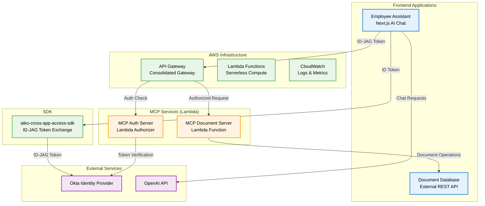
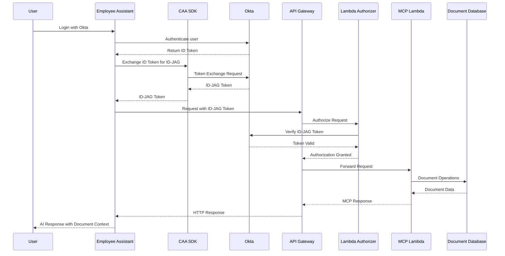
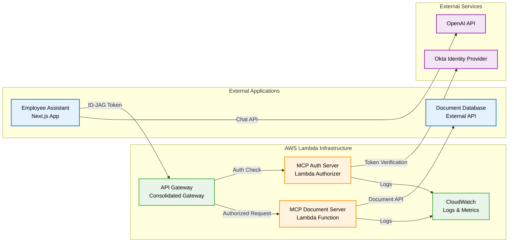

# From Authentication to Identity Propagation: Securing Serverless AI Agents and MCP Servers on AWS with Okta

*By Anton Aleksandrov, Principal Solutions Architect, AWS; Indranil Jha, Okta; and Ilya Zilver, Okta*

---

## Introduction

It's common for organizations today to experiment with building agentic systems - applications where autonomous agents plan, reason, and act across multiple services. As promising as these systems are, they introduce a new set of security considerations: how do you ensure that each agent is properly authenticated, authorized, and operating with the correct user context?

In this post, you'll learn to use Okta identity solutions to build secure agentic applications on AWS. You'll learn how authentication, authorization, and identity propagation form the foundation of trust between users, agents, MCP servers, and downstream services. Finally, you'll walk through a sample end-to-end architecture that applies these principles in practice, with a focus on AWS Lambda deployment using AWS SAM.

## Overview

Agentic applications are designed to move beyond simple request/response interactions. Unlike traditional API-driven microservices, which process requests syntactically, agentic applications use Large Language Models (LLMs) to interpret requests semantically. This enables them to plan tasks, chain actions together, and invoke multiple services autonomously on behalf of a user. As these systems mature, they increasingly resemble distributed applications composed of many agents, services, and external APIs working in concert. With this added flexibility comes greater complexity and the need for a consistent, secure approach to identity.

A central challenge in these environments is **identity propagation** - ensuring that a user's identity and intent can be securely carried across agents, services, and tools. Without strong authentication and authorization, an agent might invoke a service without the right context, overstep its privileges, or bypass enterprise policies.

[Okta Cross-App Access](https://help.okta.com/oie/en-us/content/topics/apps/apps-cross-app-access.htm) (CAA) provides a standards-based way to exchange identity tokens between applications. Combined with the [Model Context Protocol (MCP)](https://modelcontextprotocol.io/), which gives agents a consistent way to discover and call tools, these capabilities create a trusted fabric that ties users, agents, and services together.

The following sections illustrate a sample architecture for how you can integrate Okta Cross-App Access with AI agents running on AWS serverless services, such as [AWS Lambda](https://aws.amazon.com/lambda/) or [Amazon Elastic Container Service](https://aws.amazon.com/ecs/), to solve these challenges. You'll see how a user authenticates with Okta, how their identity is propagated through agents via token exchange, and how downstream services validate and enforce access.

By combining Okta's enterprise identity platform with AWS's serverless and container services, organizations can enable secure agent-to-agent and agent-to-service collaboration at scale.

## Solution Architecture

This section outlines a sample end-to-end design that ties Okta identity to agent-to-service calls on AWS, with MCP providing a consistent way for agents to discover and invoke tools. You'll see the major components, the token flow, and how identity is propagated and enforced at each hop.

### High-Level Architecture



### Authentication Flow

The sample architecture begins with a user interacting with an agentic client application, such as a web or desktop interface. The client integrates with Okta using [OpenID Connect](https://openid.net/) (OIDC) to handle authentication. Once signed in, the client receives an ID token that represents the user's identity. Rather than using that token directly for downstream calls, the client leverages the Cross-App Access (CAA) SDK to exchange it for an Identity Assertion Grant ([ID-JAG](https://drafts.aaronpk.com/draft-parecki-oauth-identity-assertion-authz-grant/draft-parecki-oauth-identity-assertion-authz-grant.html)), which is bound to a specific downstream audience. This establishes the foundation for secure identity propagation across applications.



### AWS Lambda Deployment Architecture

The ID-JAG is then presented to an authorization service running on AWS. This service verifies the assertion and issues a short-lived, audience-restricted access token. That token is scoped specifically for the resource the agent needs to call. By introducing this step, you can enforce clear trust boundaries and ensure least-privilege access to downstream services.



With the access token in hand, the agent can call tools and resources hosted on MCP servers. Each MCP server validates the incoming token before performing any action. These tools and resources may in turn call downstream protected resources, such as service APIs. In case these services run on AWS, they can enforce their own policies, relying on IAM roles and validating token claims such as user identity, scope, and tenant. This layered enforcement ensures that identity, intent, and authorization are carried consistently from the user all the way through to the backend systems.

## Implementation Details

### AWS SAM Template Structure

The solution uses AWS SAM (Serverless Application Model) to deploy the MCP services as Lambda functions with a consolidated API Gateway. Here's the key infrastructure components:

```yaml
# MCP Document Server Template
Resources:
  McpServerFunction:
    Type: AWS::Serverless::Function
    Properties:
      CodeUri: dist/
      Handler: lambda.handler
      Events:
        # All endpoints go through the single protected API Gateway
        HealthEvent:
          Type: Api
          Properties:
            Path: /mcp/health
            Method: GET
            RestApiId: !Ref McpApi
        ToolsEvent:
          Type: Api
          Properties:
            Path: /mcp/tools
            Method: GET
            RestApiId: !Ref McpApi
        ApiEvent:
          Type: Api
          Properties:
            Path: /mcp/{proxy+}
            Method: ANY
            RestApiId: !Ref McpApi

  # Single API Gateway for all endpoints (all protected)
  McpApi:
    Type: AWS::Serverless::Api
    Properties:
      StageName: prod
      Auth:
        DefaultAuthorizer: ExternalAuthorizer
        Authorizers:
          ExternalAuthorizer:
            FunctionArn: !Ref AuthorizerFunctionArn
            Identity:
              Headers:
                - Authorization
```

### MCP Server Implementation

The MCP Document Server implements the Model Context Protocol over HTTP, providing tools for document search and creation:

```typescript
// MCP Server Lambda Handler
export const handler = async (event: APIGatewayProxyEvent): Promise<APIGatewayProxyResult> => {
  const { path, httpMethod, headers } = event;
  
  // Extract and verify JWT token
  const authHeader = headers.Authorization || headers.authorization;
  if (!authHeader) {
    return {
      statusCode: 401,
      body: JSON.stringify({ error: 'Authorization header required' })
    };
  }

  try {
    // Verify JWT token using the authorizer
    const token = authHeader.replace('Bearer ', '');
    const decoded = await verifyToken(token);
    
    // Route to appropriate MCP endpoint
    switch (path) {
      case '/mcp/tools':
        return await handleToolsRequest();
      case '/mcp/tools/call':
        return await handleToolCall(event.body, decoded);
      case '/mcp/health':
        return await handleHealthCheck();
      default:
        return {
          statusCode: 404,
          body: JSON.stringify({ error: 'Endpoint not found' })
        };
    }
  } catch (error) {
    return {
      statusCode: 401,
      body: JSON.stringify({ error: 'Invalid token' })
    };
  }
};
```

### Lambda Authorizer Implementation

The MCP Auth Server acts as a Lambda authorizer, validating ID-JAG tokens and issuing MCP access tokens:

```typescript
// Lambda Authorizer for API Gateway
export const handler = async (event: APIGatewayAuthorizerEvent): Promise<APIGatewayAuthorizerResult> => {
  try {
    const token = event.authorizationToken;
    
    // Verify ID-JAG token with Okta
    const verifiedToken = await verifyIdJagToken(token);
    
    // Generate MCP access token
    const mcpToken = await generateMcpAccessToken(verifiedToken);
    
    return {
      principalId: verifiedToken.sub,
      policyDocument: {
        Version: '2012-10-17',
        Statement: [{
          Action: 'execute-api:Invoke',
          Effect: 'Allow',
          Resource: event.methodArn
        }]
      },
      context: {
        userId: verifiedToken.sub,
        mcpToken: mcpToken,
        scope: verifiedToken.scope
      }
    };
  } catch (error) {
    throw new Error('Unauthorized');
  }
};
```

### Employee Assistant Integration

The Employee Assistant uses the `atko-cross-app-access-sdk` to exchange Okta ID tokens for ID-JAG tokens:

```typescript
// Employee Assistant MCP Client
class MCPClient {
  private async exchangeTokenForIdJag(idToken: string): Promise<string> {
    const response = await this.sdk.exchangeTokenForIdJag({
      idToken,
      audience: this.idJagAudience,
      clientId: this.idJagClientId,
      clientSecret: this.idJagClientSecret
    });
    
    return response.idJagToken;
  }

  async callTool(toolName: string, arguments: any): Promise<any> {
    const idJagToken = await this.getValidIdJagToken();
    
    const response = await axios.post(
      `${this.baseUrl}/tools/call`,
      {
        tool: toolName,
        arguments
      },
      {
        headers: {
          'Authorization': `Bearer ${idJagToken}`,
          'Content-Type': 'application/json'
        }
      }
    );
    
    return response.data;
  }
}
```

## Deployment and Configuration

### Prerequisites

- Node.js 18+
- AWS CLI configured with appropriate permissions
- AWS SAM CLI installed
- Okta Developer Account with Cross-App Access enabled
- OpenAI API Key for AI chat functionality

### Environment Configuration

```bash
# MCP Server Environment Variables
export DOCUMENT_DATABASE_URL="https://your-document-database.vercel.app/api"
export JWT_SECRET="your-long-random-jwt-secret-here"
export OKTA_ISSUER="https://your-domain.okta.com"
export ID_JAG_AUDIENCE="https://your-domain.com"

# Employee Assistant Configuration
MCP_DEPLOYMENT_MODE=lambda
MCP_LAMBDA_URL=https://your-api-gateway.amazonaws.com/prod/mcp
```

### Deployment Commands

```bash
# Deploy MCP Document Server
cd atko-document-server-mcp
npm run build:lambda
sam build
sam deploy --parameter-overrides \
  DocumentDatabaseUrl="https://your-db.vercel.app/api" \
  JwtSecret="your-secret" \
  OktaIssuer="https://your-domain.okta.com" \
  IdJagAudience="https://your-domain.com"

# Deploy MCP Auth Server
cd ../atko-document-server-mcp-auth
npm run build:lambda
sam build
sam deploy --guided
```

## Considerations and Best Practices

When building secure agentic applications, engineering teams should adopt stringent security controls and proven best practices. The following principles provide a strong foundation for securely building agentic systems and MCP servers:

### Identity Validation

**Validate identity at every boundary.** Each AI agent and each MCP server must independently verify access tokens, checking issuer, audience, scope, signature, and expiration. Never rely on upstream validation alone - this ensures agents cannot bypass enforcement by chaining calls.

### Token Management

**Use short-lived, scoped tokens.** Always follow the least privileged access approach and scope tokens to the minimum privileges required. Access tokens issued for agents should be valid for a short period only (minutes, not hours) and tied to specific MCP tools (e.g., `documents.read` vs. `documents.write`). If an agent needs to invoke another tool, perform a token exchange to issue a new token with narrower scope.

### Context Propagation

**Propagate user context securely.** Use [Okta Cross‑App Access](https://help.okta.com/oie/en-us/content/topics/apps/apps-cross-app-access.htm) to transport identity across services. When agents invoke MCP servers, include claims such as **sub** (end-user), **azp** (authorized party), **aud** (audience), and **act** to track on-behalf-of execution. This ensures downstream services can enforce policies knowing both who initiated the request and why it was made.

### Observability and Auditing

**Audit and trace agent chains end-to-end.** Log structured events and auth decisions at each segment, showing full actor trace (for example: user → agent → MCP tool), scopes used, and decisions made. Use observability services such as [Amazon CloudWatch](https://aws.amazon.com/cloudwatch/) and [AWS X-Ray](https://aws.amazon.com/xray/) to trace a request across multiple agents and tools, so you can always answer "who asked the agent to act, what tool was invoked, and what data was accessed".

### AWS-Specific Security

- **IAM Roles**: Use minimal required permissions for Lambda functions
- **API Gateway**: Enable CORS, rate limiting, and HTTPS enforcement
- **CloudWatch Logs**: Centralized logging with retention policies
- **VPC Configuration**: Consider VPC for additional network isolation if needed

## Testing and Validation

### Local Testing

```bash
# Test Lambda functions locally
sam local start-api
sam local invoke McpAuthorizerFunction --event events/authorizer-event.json
```

### Production Testing

```bash
# Test all endpoints (all require authentication)
curl -H "Authorization: Bearer YOUR_ID_JAG_TOKEN" \
  https://your-api-gateway.amazonaws.com/prod/mcp/health

curl -H "Authorization: Bearer YOUR_ID_JAG_TOKEN" \
  https://your-api-gateway.amazonaws.com/prod/mcp/tools/call \
  -d '{"tool":"search_documents","arguments":{"query":"test"}}'
```

### Monitoring and Debugging

```bash
# View Lambda function logs
aws logs tail /aws/lambda/atko-document-server-mcp-McpServerFunction-* --follow

# View authorizer logs
aws logs tail /aws/lambda/atko-document-server-mcp-aut-McpAuthorizerFunction-* --follow

# Check API Gateway metrics
aws cloudwatch get-metric-statistics \
  --namespace AWS/ApiGateway \
  --metric-name Count \
  --dimensions Name=ApiName,Value=your-api-name
```

## Conclusion

Agentic applications open the door to new ways of automating tasks and connecting services, but they also introduce unique security considerations. Every agent and MCP server must operate with the right user context, enforce least privilege, and leave a clear audit trail. Without strong foundations in authentication, authorization, and identity propagation, these systems can quickly become unmanageable or unsafe.

By combining Okta's Cross-App Access and identity solutions with AWS's serverless and container services, organizations can build agentic systems that scale securely. The approach outlined in this post demonstrates how to authenticate users, propagate their identity through agents, issue scoped tokens for MCP tools, and enforce policy at every boundary. With these patterns in place, engineering teams can innovate with agentic applications while maintaining the trust, governance, and security that enterprises require.

The AWS Lambda deployment approach provides several advantages:
- **Serverless scalability**: Automatic scaling based on demand
- **Cost optimization**: Pay-per-use pricing model
- **Managed security**: AWS handles infrastructure security
- **Integration**: Native integration with AWS services
- **Monitoring**: Comprehensive observability with CloudWatch and X-Ray

To learn more, explore the [Okta Cross-App Access](https://help.okta.com/oie/en-us/content/topics/apps/apps-cross-app-access.htm) documentation and [AWS serverless](https://serverlessland.com/) services, or try out the [GitHub sample](https://github.com/indranilokg/okta-cross-app-access-demo) showcased in this post.

---

## Resources

- [Okta Cross App Access](https://help.okta.com/oie/en-us/content/topics/apps/apps-cross-app-access.htm)
- [MCP Specification](https://modelcontextprotocol.io/)
- [AWS Lambda Documentation](https://docs.aws.amazon.com/lambda/)
- [AWS SAM Documentation](https://docs.aws.amazon.com/serverless-application-model/)
- [API Gateway Documentation](https://docs.aws.amazon.com/apigateway/)
- [Sample Implementation](https://github.com/indranilokg/okta-cross-app-access-demo)
- [Cross-App Access SDK](https://github.com/indranilokg/atko-cross-app-access-sdk)
- [AWS Serverless MCP Samples](https://github.com/aws-samples/sample-serverless-mcp-servers/tree/main/stateless-mcp-on-lambda-nodejs)
